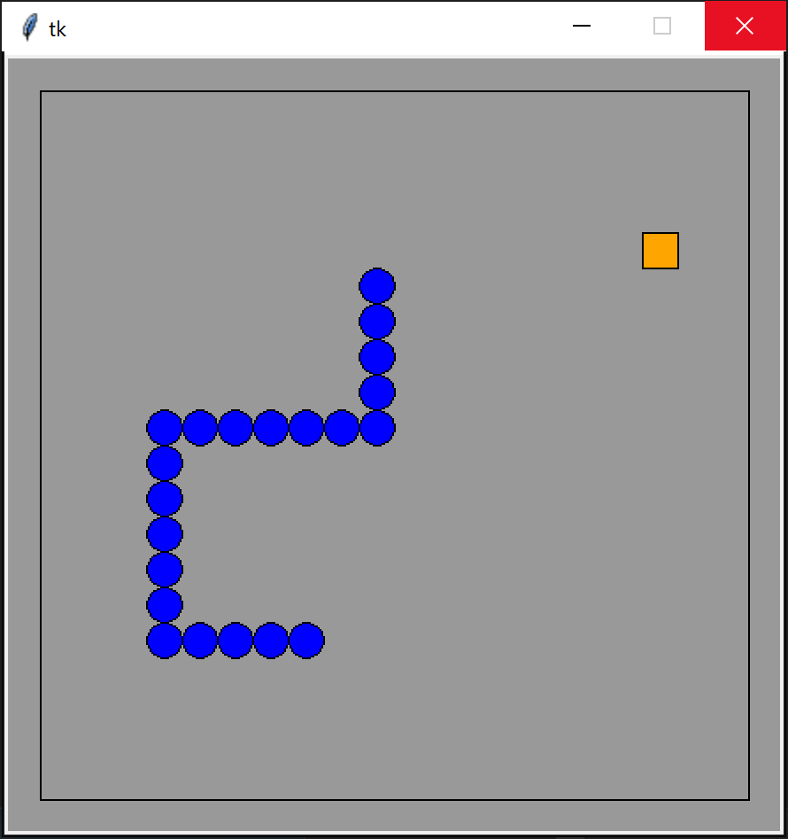

# pythonic_snake
When choosing a programming language to program the game snake python is the best fit, because you know they are the same thing XD. seriously: \
This is a simple snake game programmed with python using only tkinter (and random). \
You move with the arrow keys and restart the game with space bar.

